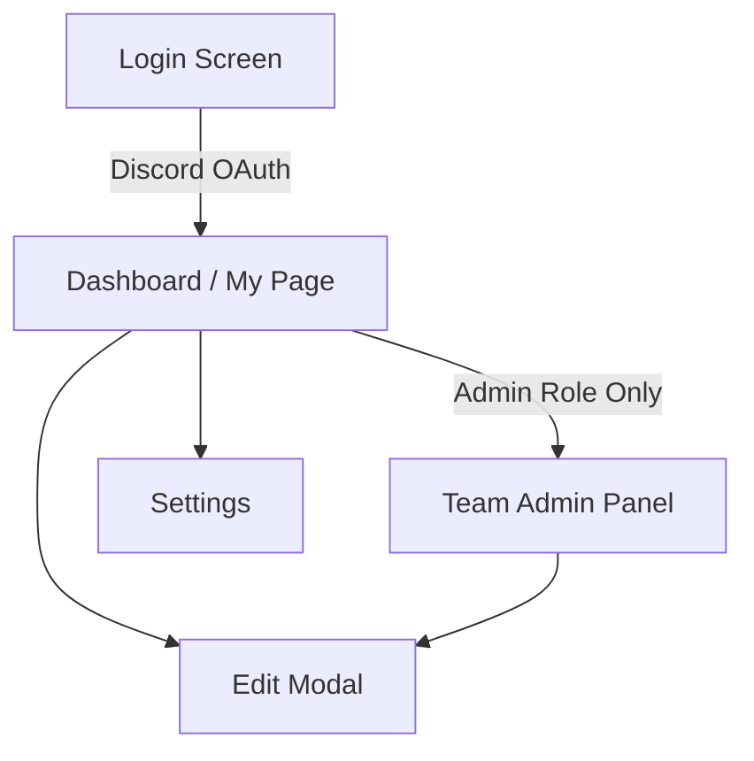
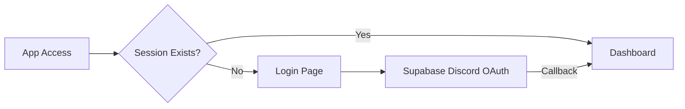
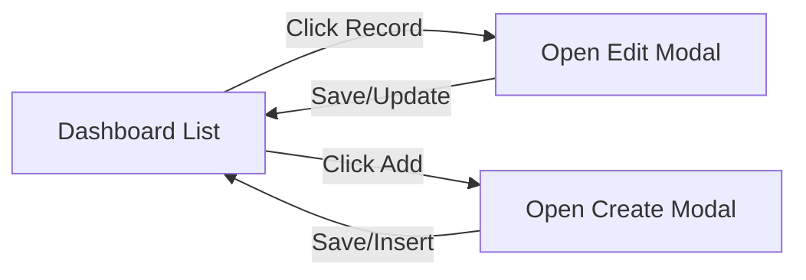
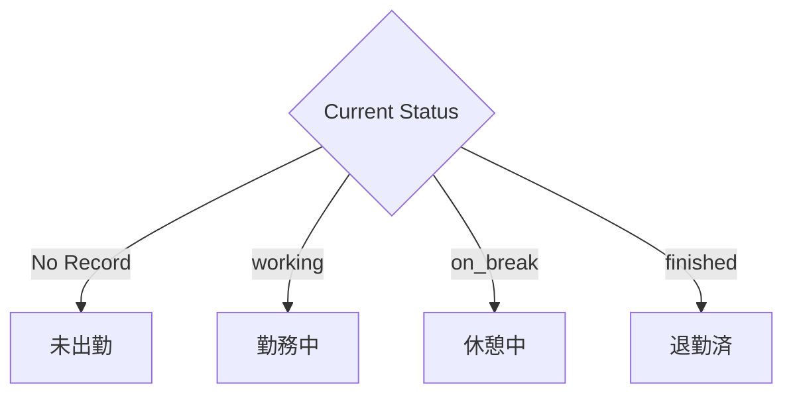
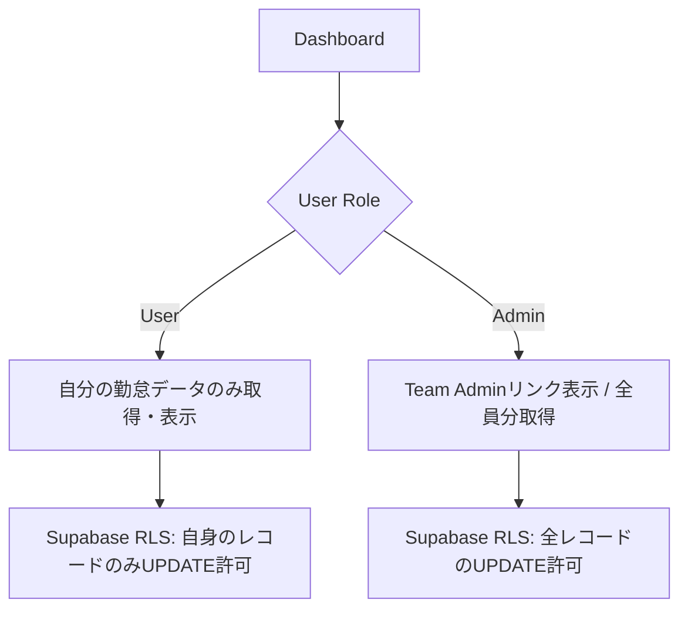
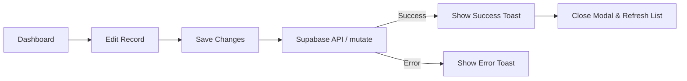
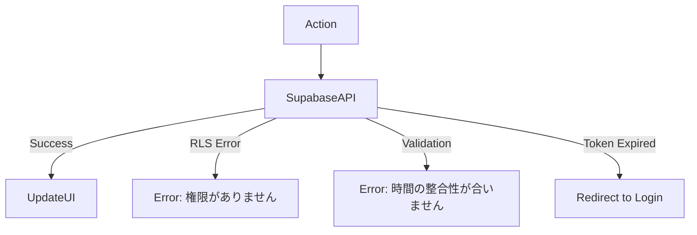
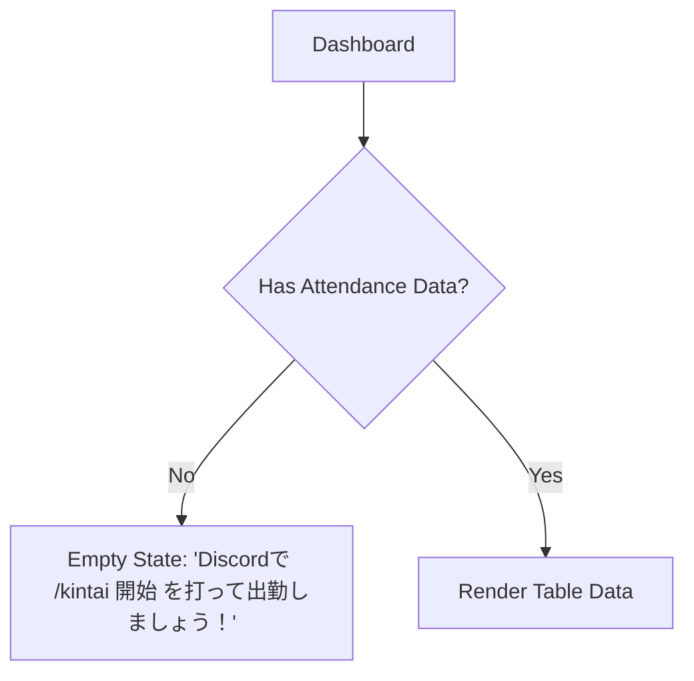

# 🖥️ 03_screen-flow.md

---

# 0️⃣ 設計前提

| 項目     | 内容                            |
| ------ | ----------------------------- |
| 対象ユーザー | Discordで打刻を行う一般ユーザー / 勤怠管理者          |
| デバイス   | Desktop / Mobile (Responsive対応) |
| 認証要否   | 全面認証制（未ログイン時はログイン画面へリダイレクト） |
| 権限制御   | RBAC（Admin：全員のデータ閲覧・編集 / User：自身のデータのみ） |
| MVP範囲  | P0（ログイン、ダッシュボード一覧、編集機能）のみ                        |

---

# 1️⃣ 画面一覧（Screen Inventory）

| ID   | 画面名     | 役割     | 認証  | 優先度 |
| ---- | ------- | ------ | --- | --- |
| S-01 | ログイン    | Discord OAuthでの認証 | 不要  | 🔴 P0  |
| S-02 | ダッシュボード | 自分の勤怠一覧・ステータス確認 | 必須  | 🔴 P0  |
| S-03 | 編集モーダル | 打刻漏れ・時間の修正 | 必須  | 🔴 P0  |
| S-04 | チーム管理   | （管理者用）メンバーの勤怠一覧 | 管理者 | 🟡 P1  |
| S-05 | 設定画面    | 表示設定・エクスポート等 | 必須  | 🟢 P2  |

---

# 2️⃣ 全体遷移図（高レベル）



---

# 3️⃣ 認証フロー



---

# 4️⃣ CRUD標準遷移テンプレ（モーダル運用）

管理画面では別ページに遷移せず、一覧画面（Dashboard）から直接モーダルを開いて編集するモダンなUXを採用。



---

# 5️⃣ 状態別分岐（State-based Flow）

Discordでの打刻状況に応じた、ダッシュボード上の現在ステータス表示の分岐。



---

# 6️⃣ 権限別分岐（RBAC）



---

# 7️⃣ モーダル・非同期操作



---

# 8️⃣ エラーフロー



---

# 9️⃣ 空状態 / 初回体験



---

# 🔟 モバイル考慮

| 項目      | Desktop | Mobile     |
| ------- | ------- | ---------- |
| ナビゲーション | Sidebar | Bottom Navigation / Hamburger |
| 一覧表示    | Table（列多数） | Card View（縦積みスクロール） |
| 編集画面    | Modal | Full Screen Dialog / Bottom Sheet |

---

# 12️⃣ URL設計テンプレ

Next.js (App Router) を想定したルーティング。

```text
/login                # ログイン画面
/                     # ダッシュボード（自分の勤怠一覧）
/admin                # チーム管理画面（管理者のみアクセス可）
/settings             # ユーザー設定・エクスポート
```