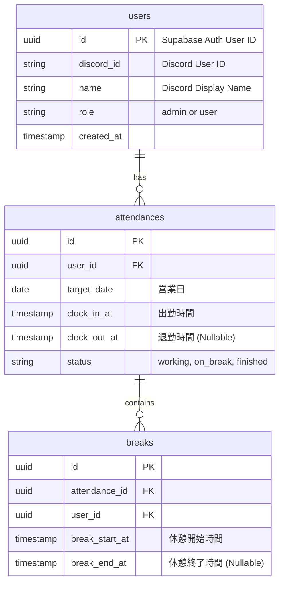

# 🗄️ 05_erd.md (DB設計書)

---

# 0️⃣ 設計観点

| 項目      | 内容                                    |
| ------- | ------------------------------------- |
| 権限モデル   | Hybrid (RBAC + ABAC / Supabase RLSにてDBレイヤーで直接制御) |
| ID戦略    | UUID v4 (勤怠・休憩データ / アプリ内ユーザー) / Discord ID (外部識別子) |
| 論理削除    | 無 (勤怠データは基本的に物理削除しない運用を想定)          |
| 監査ログ    | 任意 (MVPフェーズでは不要、Supabaseの標準ログに依存)      |

---

# 1️⃣ テーブル一覧

| ドメイン  | テーブル名             | 役割     | Phase |
| ----- | ----------------- | ------ | ----- |
| アカウント | users             | Discordユーザー情報と権限 | P0    |
| コア機能  | attendances       | 1日単位の出退勤レコード   | P0    |
| コア機能  | breaks            | 1日複数回対応の休憩レコード | P0    |

---

# 2️⃣ ERD

---

# 3️⃣ カラム定義

## users

| カラム        | 型         | 制約              | 説明              |
| ---------- | --------- | --------------- | --------------- |
| id         | UUID      | PK              | Supabase AuthのユーザーID |
| discord_id | VARCHAR   | UNIQUE          | DiscordのユーザーID |
| name       | VARCHAR   | NOT NULL        | Discord上の表示名 |
| role       | VARCHAR   | DEFAULT 'user'  | 'admin' または 'user' |
| created_at | TIMESTAMP | DEFAULT NOW()   | レコード作成日時 |

---

## attendances（勤怠レコード）

| カラム        | 型         | 制約       | 説明                    |
| ---------- | --------- | -------- | --------------------- |
| id         | UUID      | PK, DEFAULT uuid_generate_v4() |                       |
| user_id    | UUID      | FK (users.id) | 誰の打刻データか |
| target_date| DATE      | NOT NULL | 集計用の営業日（日跨ぎ対応用） |
| clock_in_at| TIMESTAMP | NOT NULL | 出勤打刻時間 |
| clock_out_at| TIMESTAMP| NULLABLE | 退勤打刻時間（退勤前はNULL） |
| status     | VARCHAR   | NOT NULL | 'working' / 'on_break' / 'finished' |

---

## breaks（休憩レコード）

| カラム          | 型         | 制約       | 説明                    |
| ------------ | --------- | -------- | --------------------- |
| id           | UUID      | PK, DEFAULT uuid_generate_v4() |                       |
| attendance_id| UUID      | FK (attendances.id) | どの勤怠レコードに紐づくか |
| user_id      | UUID      | FK (users.id) | どのユーザーの休憩か |
| break_start_at| TIMESTAMP| NOT NULL | 休憩開始時間 |
| break_end_at | TIMESTAMP | NULLABLE | 休憩終了時間（戻る前はNULL） |

---

# 4️⃣ 権限設計（Supabase RLS ポリシー）

## RBAC / ABAC (DBレベルのアクセス制御)

SupabaseのRow Level Security (RLS) を使用して、データの参照・更新権限を制御します。

| 対象テーブル | アクション | 許可される条件 (USING / WITH CHECK) | 備考 |
| :--- | :--- | :--- | :--- |
| `attendances` / `breaks` | SELECT | `user_id = auth.uid()` OR `(SELECT role FROM users WHERE id = auth.uid()) = 'admin'` | 自分のデータは閲覧可。管理者は全データ閲覧可。 |
| `attendances` / `breaks` | INSERT / UPDATE | `user_id = auth.uid()` OR `(SELECT role FROM users WHERE id = auth.uid()) = 'admin'` | 自分のデータのみ打刻・修正可。管理者は全データ修正可。 |
| `users` | SELECT | `true` | （Botのメンション等に使うため）全ユーザーが一覧可能 |
| `users` | UPDATE | `(SELECT role FROM users WHERE id = auth.uid()) = 'admin'` | ロールの変更は管理者のみ可能 |