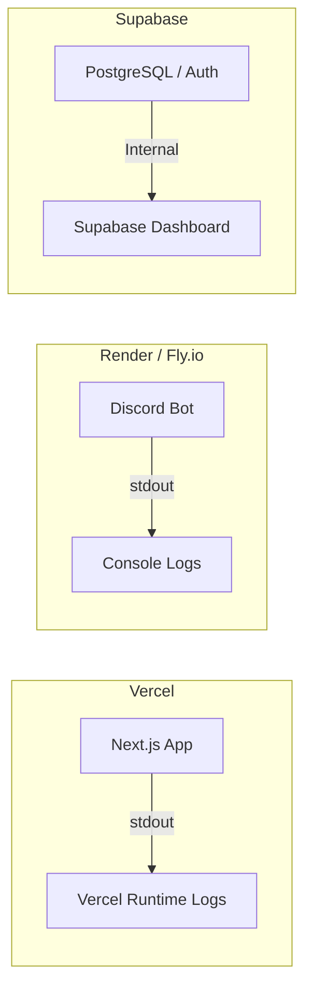

# 📘 08_logging.md (ログ設計書)

---

# 0️⃣ 設計前提

| 項目     | 内容                       |
| ------ | ------------------------ |
| 対象システム | Web (Next.js) / Bot (discord.js) / DB (Supabase) |
| ログ方式   | 構造化ログ（JSON）推奨（Bot側は `pino` 等のライブラリ使用） |
| 集約方式   | 分散管理（MVPフェーズでは Vercel / Render / Supabase 各々のダッシュボードで確認） |
| 保持期間   | 各プラットフォームの無料枠に依存（Vercel: 最新のみ, Render: 最新のみ, Supabase: 1〜7日） |
| 個人情報   | 各種APIキー、DB接続URL、Discordトークンの出力は絶対禁止 |

---

# 1️⃣ ログ分類

| 種別                 | 目的        | 出力対象・確認場所 |
| ------------------ | --------- | ------ |
| Application Log    | コマンド実行結果・APIエラー | Bot (Render) / Web (Vercel) |
| Access Log         | 画面へのアクセス追跡   | Web (Vercel Analytics/Logs) |
| Audit Log          | 認証履歴・データ変更履歴 | DB/Auth (Supabase Dashboard) |

※ Security, Business, Infrastructureログは無料枠のマネージドサービスに依存するため、アプリ側での独自実装は行わない。

---

# 2️⃣ ログレベル定義

| レベル   | 用途          |
| ----- | ----------- |
| DEBUG | ローカル開発時のみ有効化（本番では出力しない） |
| INFO  | 正常動作（Botの起動完了、打刻完了など） |
| WARN  | 想定内の異常（「既に出勤済みです」などのユーザー操作エラー） |
| ERROR | 処理失敗（SupabaseへのInsert失敗、APIタイムアウトなど） |
| FATAL | MVPフェーズでは使用しない |

---

# 3️⃣ 構造化ログフォーマット（JSON標準）

BotやAPIのエラー時に標準出力（stdout）へ流すフォーマットの例です。

```json
{
  "timestamp": "2025-01-01T10:00:00Z",
  "level": "INFO",
  "service": "discord-bot",
  "environment": "production",
  "user_id": "8d8f1b7c-0d52-4f8d-9f8e-4f7c9b9f0f31",
  "discord_user_id": "123456789012345678",
  "action": "command.kintai_start",
  "message": "出勤打刻が正常に完了しました"
}
```

---

# 4️⃣ 必須フィールド

| フィールド     | 理由         |
| --------- | ---------- |
| timestamp | 時系列追跡      |
| level     | 重要度        |
| service   | どこで起きたか（`web` or `bot`） |
| user_id   | 誰が操作したか（Supabase AuthのユーザーID / `auth.uid()`） |
| discord_user_id   | DiscordのUser ID（Bot側で参照できる場合のみ） |
| action    | どの処理か（例: `attendance.update`） |

※ MVPフェーズでは、サービス間の呼び出し（Web→Bot等）がないため `trace_id` やマルチテナント用の `tenant_id` は不要。

---

# 5️⃣ Application Log設計

### 目的

* デバッグ
* 障害解析（打刻が反映されない等の問い合わせ対応）

### 出力例（エラー時）

```json
{
  "level": "ERROR",
  "service": "discord-bot",
  "user_id": "8d8f1b7c-0d52-4f8d-9f8e-4f7c9b9f0f31",
  "discord_user_id": "123456789012345678",
  "action": "db.insert_attendance",
  "message": "Supabaseへの出勤データ保存に失敗しました",
  "error_code": "23505",
  "error_details": "duplicate key value violates unique constraint"
}
```

---

# 6️⃣ Access Log設計

Next.js (Vercel) へのアクセスログは、Vercelの標準機能で自動収集されるため、アプリケーション側で明示的なアクセスログの実装は行いません。

---

# 7️⃣ Audit Log設計

認証やデータベースの変更といった監査ログは、すべて **Supabaseの標準機能** に寄せます。

* **認証ログ:** Supabase Dashboard > Authentication > Logs
* **DB操作ログ:** Supabase Dashboard > Database > Postgres Logs

---

# 8️⃣ セキュリティログ

| イベント      | 記録箇所 |
| --------- | -- |
| Discord連携（ログイン）失敗    | Supabase Auth Logs |
| Web画面の不正アクセス（RLSによるDeny）    | Supabase Postgres Logs |

---

# 9️⃣ ログ保存構成

無料枠を活用するため、ログを1箇所に集約せず、各サービスの標準出力をそのまま利用します。



---

# 🔟 マスキングポリシー

| 対象    | 方針       |
| ----- | -------- |
| Discord Token | 絶対出力禁止 (環境変数としてのみ扱う) |
| Supabase Service Role Key | 絶対出力禁止 |
| セッションJWT  | 絶対出力禁止 |
| Discordユーザー名 / Discord User ID | ログ出力可（トラブルシューティングのため） |

---

# 11️⃣ フェーズ導入

```text
【Phase 0: MVP】
- 各サービスのダッシュボードでの目視確認のみ
- console.log / console.error の使用

【Phase 1: 構造化】
- BotおよびNext.js API Routesに `pino` 等を導入し、JSON形式での出力に統一
- WARN以上のログが出た場合、管理者用のDiscordチャンネルに通知を送るWebhookを実装

【Phase 2: 集約（コスト発生時）】
- 運用が本格化した場合、DatadogやAxiomなどの外部SaaSへログを転送し一元管理する
```

---

# 12️⃣ コスト最適化

| 方法      | 説明        |
| ------- | --------- |
| INFO以下の削減 | 本番環境ではアクセス過多を防ぐため、打刻ごとのINFOログを減らしエラーのみ出力するように調整 |
| SaaSの不使用 | MVPフェーズでは外部のログ集約サービス（Logtail等）を使用せず、ランニングコストを0円に保つ |